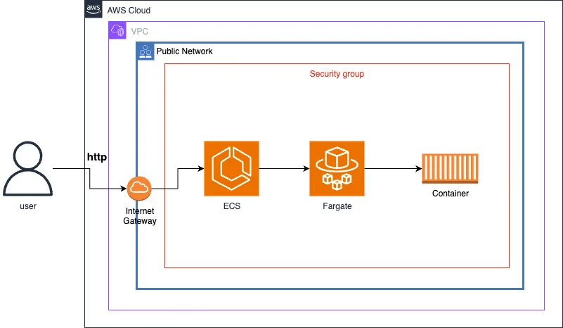
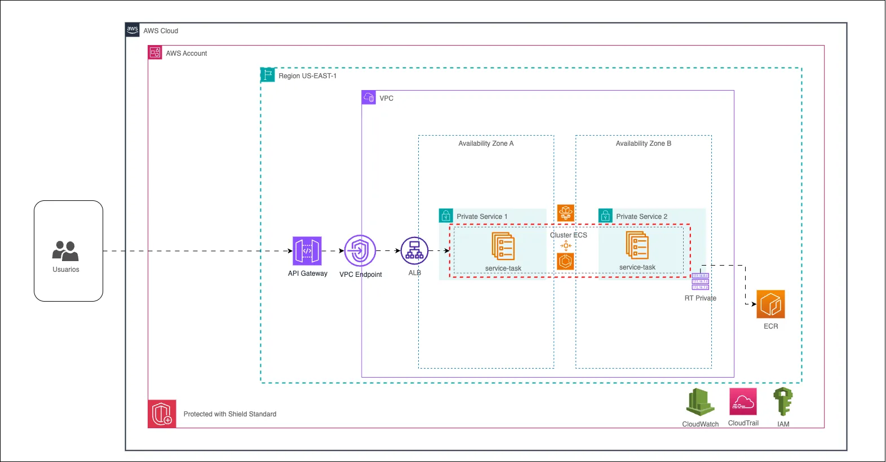

# Arquetipo NodeJs - Express con docker, serverless y terraform

Aplicación express con Serverless Framework y Terraform para la creación y despliegue de los contenedores en una cuenta de AWS. El proyecto cuenta con Serverless Framework y Terraform preconfigurados con el fin de desplegar la infraestructura base para ejecutar contenedores. La idea es que podamos habilitar dicha infraestructura base para poder crear contenedores y despegarlos en AWS de forma automatizada.

## Arquitectura de la solución
#### Arquitectura generada por Serverless Framework



#### Arquitectura generada por Terraform



## Requisitos de sistema

Antes de clonar el repositorio, asegurate de tener las siguientes herramientas para la instalación y despliegue del proyecto:

- [Instalar Docker](https://www.docker.com/get-started)
- [Instalar Serverless Framework](https://www.serverless.com/framework/docs/getting-started)
- [Instalar Node.js y npm](https://nodejs.org/en/)
- [Instalar git](https://git-scm.com/)

## Instalación

* Clonar el repositorio e ingresar a la carpeta

```bash
git clone https://github.com/jemgdev-pragma/serverless-docker-typescript-template.git <nombre_carpeta>
cd <nombre_carpeta>
```

* Eliminar el .git del arquetipo

#### Bash:
```bash
rm -rf .git
```
#### Powershell
```powershell
Remove-Item -Path ".git" -Recurse -Force
```

* Inicializar nuevo repositorio

```bash
git init
git fetch
```

* Agregar nuevo repositorio de trabajo

```bash
git remote add origin <url>
```

## Variables de entorno

Para poder desplegar el proyecto, vas a necesitar configurar las siguientes variables de entorno en tus workflows, tanto github actions, azure pipelines o terraform:

`AWS_REGION, Example: us-east-1`

`ECR_REPOSITORY, Example: template-image-dev`

`IMAGE_TAG, Example: latest`

`CLUSTER_NAME, Example: template-cluster-dev`

`SERVICE_NAME, Example: template-ecs-service-dev`

`ENVIRONMENT, Example: dev`

Luego deberas configurar estas variables en los secretos de la configuración:

`AWS_ACCESS_KEY_ID [Your access key id from IAM user]`

`AWS_SECRET_ACCESS_KEY [Your secret access key from IAM user]`

`AWS_ACCOUNT_ID [Your account id]`

`VPC_ID [Your vpc id]`

`SUBNET_ID [Your public subnet id in the vpc]`

## Ejecución local

En la consola entra a la carpeta del proyecto

```bash
cd serverless-docker-typescript-template
```

Instala las dependencias

```bash
npm install
```

Asegurate de tener tu docker activo, en caso de estar en linux puedes ejecutar:

```bash
sudo systemctl is-active docker
```

Puedes ejecutar el proyecto sin necesidad de crear el contenedor con esto:

```bash
npm run dev
```

Para crear el contenedor solo deberas realizar lo siguiente:

```bash
docker build -t <nombre_contenedor> .
docker run -p <puerto_externo>:3000 <nombre_contenedor>
```

## Tests

Para ejecutar los test, ejecuta el siguiente comando en la terminal

```bash
  npm run test
```

## Detalles del proyecto

El proyecto utiliza la arquitectura de capas usado en Pragma, puedes encontrar más información
en el siguiente link: [Arquitectura de capas](https://github.com/somospragma/backend-diseno-arquitectura-fnc-ts-archetypes-sam-lambda)

```bash
.
├── .github
│   └── workflows
│       ├── deploy-dev.yml
│       └── deploy-prod.yml
├── public
│   └── index.html
├── serverless
│   └── serverless.yml
├── terraform
│   ├── main.tf
│   ├── modules
│   │   ├── ecr
│   │   │   ├── main.tf
│   │   │   └── variables.tf
│   │   ├── ecs
│   │   │   ├── main.tf
│   │   │   └── variables.tf
│   │   └── security-group
│   │       ├── main.tf
│   │       └── variables.tf
│   ├── provider.tf
│   └── variables.tf
├── src
│   ├── app
│   │   ├── get-all-users.app.ts
│   │   ├── save-user.app.ts
│   │   └── tests
│   │       └── unit
│   │           ├── get-all-users.app.test.ts
│   │           └── save-user.app.test.ts
│   ├── config
│   │   ├── contants.ts
│   │   ├── express.config.ts
│   │   ├── logger.ts
│   │   └── schema
│   │       └── save-user.schema.ts
│   ├── controllers
│   │   └── user.controller.ts
│   ├── handler
│   │   └── user.routes.ts
│   ├── middlewares
│   │   ├── error-handler.ts
│   │   ├── not-found.ts
│   │   └── unauthorized.ts
│   ├── models
│   │   └── user.model.ts
│   └── services
│   │   ├── tests
│   │   │   └── unit
│   │   │       └── user-memory.service.test.ts
│   │   └── user-memory.service.ts
│   └── app.ts
├── .gitignore
├── azure-pipelines.yml
├── diagram.drawio
├── diagram.webp
├── Dockerfile
├── jest.config.ts
├── LICENSE
├── package.json
├── README.md
└── tsconfig.json
```

## Desplegar la aplicación de ejemplo (Usando Serverless Framework)

Este proyecto utiliza como estrategia de branching **Trunk-Based Development**, donde todas las nuevas funcionalidades se integran directamente sobre la rama principal (`main`) mediante *pull requests* pequeños y frecuentes.

El flujo de integración y despliegue continuo (CI/CD) se implementa utilizando **GitHub Actions**.  
La configuración del pipeline se encuentra dentro de la carpeta `.github/` y se ejecuta automáticamente cuando se abre un *pull request* contra la rama `main`.

> **Requisito previo:**  
> Antes de ejecutar el pipeline, es indispensable contar con una **VPC configurada** que incluya **al menos una subred pública**. Esto permitirá que el contenedor desplegado en ECS sea accesible desde internet.  
> Además, la subred deberá estar asociada a una **Internet Gateway**

Cuando se activa el pipeline (pull request a `main`), se ejecutan las siguientes etapas:

### 1. Checkout del código
Se clona el repositorio en el *runner* de GitHub Actions (`ubuntu-latest`) para iniciar el proceso de construcción.

### 2. Validación de Docker
Se comprueba que el entorno de ejecución tenga disponible Docker (`docker --version`).

### 3. Configuración de credenciales AWS
Se configuran las credenciales de AWS utilizando `aws-actions/configure-aws-credentials@v4` con los valores almacenados en `secrets`.

### 4. Creación o verificación del repositorio ECR
Se valida la existencia del repositorio **Amazon ECR**.  
En caso de no existir, se crea automáticamente en la región configurada (`AWS_REGION`).

### 5. Inicio de sesión en ECR
Se realiza la autenticación contra ECR utilizando `aws ecr get-login-password`.

### 6. Construcción y publicación de la imagen Docker
- Se construye la imagen Docker (`docker build`).
- Se etiqueta (`docker tag`) con el formato `ACCOUNT_ID.dkr.ecr.REGION.amazonaws.com/REPO:TAG`.
- Se publica en el repositorio ECR (`docker push`).

### 7. Verificación de servicio ECS
Se valida si el **Cluster ECS** (`CLUSTER_NAME`) y el **Servicio ECS** (`SERVICE_NAME`) existen en AWS.

### 8. Actualización del servicio ECS (si existe)
Si el servicio está creado, se fuerza una nueva implementación usando:

```bash
aws ecs update-service \
    --cluster $CLUSTER_NAME \
    --service $SERVICE_NAME \
    --force-new-deployment \
    --region $AWS_REGION || {
        echo "❌ Error in ECS service update."
        exit 1
    }
```

### 9. Despliegue inicial con Serverless Framework (si no existe ECS)
Si el ECS no existe, se levanta toda la infraestructura usando Serverless Framework:

```bash
echo "🚀 Install Serverless CLI..."
npm install -g serverless@3
echo "📦 Deploying with Serverless..."
serverless deploy --config serverless/serverless.yml --verbose --stage dev \
--param "port=3000" \
--param "expose_port=3000" \
--param "vpc_id=${{ secrets.VPC_ID }}" \
--param "subnet_id=${{ secrets.SUBNET_ID }}"
```
Nota: Si se piensa utilizar terraform deberá modificar solamente esta parte del pipeline en los workflows de github o pipeline de azure dependiendo cual se esté utilizando.

Finalmente podras visualizar en ECS el cluster de Fargate donde se está ejecutando el contenedor. Muy importante tener en cuenta que hay que esperar un cierto tiempo para que AWS pueda entregar la IPv4 del contenedor y así poder hacer las pruebas necesarias.

## Desplegar la aplicación de ejemplo (Usando Terraform)

El flujo de integración y despliegue continuo (CI/CD) se implementa utilizando **GitHub Actions**.  
La configuración del pipeline se encuentra dentro de la carpeta `.github/` y se ejecuta automáticamente cuando se abre un *pull request* contra la rama `main`.

> **Requisito previo:**  
> Antes de ejecutar el despliegue con terraform, es indispensable contar con una **VPC configurada** ya que se pedira esta información al momento de ejecutar los comandos de despliegue.


### 1. Configuración de credenciales AWS
Se configuran las credenciales de AWS para que Terraform y Docker puedan interactuar con los servicios:
```bash
export AWS_ACCESS_KEY_ID=<tu_access_key>
export AWS_SECRET_ACCESS_KEY=<tu_secret_key>
export AWS_REGION=us-east-1
```

### 2. Construcción y prueba de la imagen Docker
* Construir la imagen Docker localmente:
```bash
docker build -t <nombre_contenedor>:latest .
```
* Probar la imagen localmente (opcional):
```bash
docker run -p <puerto_externo>:3000 <nombre_contenedor>:latest
```

### 3. Creación o verificación del repositorio ECR
* Obtener el ID de cuenta y login a ECR:
```bash
ACCOUNT_ID=$(aws sts get-caller-identity --query Account --output text)
aws ecr describe-repositories --repository-names <nombre_contenedor> --region $AWS_REGION || \
aws ecr create-repository --repository-name <nombre_contenedor> --region $AWS_REGION
aws ecr get-login-password --region $AWS_REGION | docker login --username AWS --password-stdin $ACCOUNT_ID.dkr.ecr.$AWS_REGION.amazonaws.com
```

### 4. Publicación de la imagen en ECR
* Etiquetar la imagen para ECR:
```bash
docker tag payment-api:latest $ACCOUNT_ID.dkr.ecr.$AWS_REGION.amazonaws.com/payment-api:latest
```
* Subir la imagen:
```bash
docker push $ACCOUNT_ID.dkr.ecr.$AWS_REGION.amazonaws.com/payment-api:latest
```

### 5. Inicialización de Terraform
Desde la carpeta `terraform` que está en la raíz del proyecto, inicializar Terraform y descargar proveedores:
```bash
terraform init
```

### 6. Validación de la configuración Terraform
* Etiquetar la imagen para ECR:
```bash
docker tag payment-api:latest $ACCOUNT_ID.dkr.ecr.$AWS_REGION.amazonaws.com/payment-api:latest
```
* Subir la imagen:
```bash
docker push $ACCOUNT_ID.dkr.ecr.$AWS_REGION.amazonaws.com/payment-api:latest
```

### 7. Aplicar la infraestructura con Terraform
* Aplicar el plan:
```bash
terraform apply tfplan
```
Terraform desplegará:
* VPC link y API Gateway (si aplica)
* ALB interno
* Security Groups
* ECS Cluster
* ECS Service + Task con la imagen de Docker desde ECR
* IAM Roles y CloudWatch Logs

### 8. Verificación del servicio ECS
* Revisar en la consola ECS que el cluster y el servicio estén activos y que los contenedores estén en `RUNNING`.
* Revisar los CloudWatch Logs de `/ecs/payment-api` para verificar que la aplicación esté iniciando correctamente.

### 9. Actualización del servicio ECS
Si se realiza un cambio en la imagen Docker:
```bash
# Reconstruir y subir nueva imagen
docker build -t payment-api:latest .
docker tag payment-api:latest $ACCOUNT_ID.dkr.ecr.$AWS_REGION.amazonaws.com/payment-api:latest
docker push $ACCOUNT_ID.dkr.ecr.$AWS_REGION.amazonaws.com/payment-api:latest

# Forzar redeploy de ECS
terraform apply
```
Terraform detectará que la task_definition cambió y redeplegará el servicio.

> **Importante:**  
> Al finalizar, el contenedor estará corriendo en ECS Fargate y accesible mediante el ALB (si está configurado público).
> Es importante esperar unos segundos para que AWS asigne la IPv4 del contenedor antes de realizar pruebas de acceso.